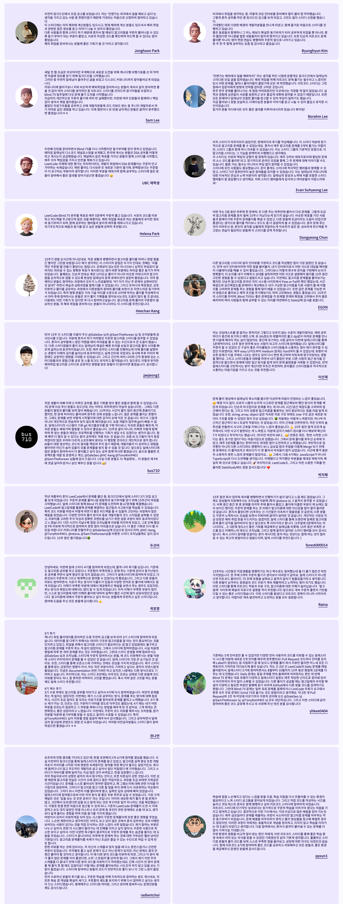

# 리트코드 스터디

🛫 해외취업을 위한 오픈소스 기반 알고리즘 스터디

- 웹사이트: https://www.dalestudy.com/
- 리더보드: https://leaderboard.dalestudy.com/
- 위키: https://github.com/DaleStudy/leetcode-study/wiki
- 게시판: https://github.com/DaleStudy/leetcode-study/discussions
- 채팅방: https://discord.com/channels/775115965964222492/1229860988170403901

## 차수

- 7기 (Mar 1, 2025 - Jun 13, 2026): [프로젝트](https://github.com/orgs/DaleStudy/projects/26/views/3), [팀](https://github.com/orgs/DaleStudy/teams/leetcode07)
- 6기 (Nov 8, 2025 - Feb 20, 2026): [프로젝트](https://github.com/orgs/DaleStudy/projects/23/views/3), [팀](https://github.com/orgs/DaleStudy/teams/leetcode06)
- 5기 (Jul 20, 2025 - Nov 1, 2025): [프로젝트](https://github.com/orgs/DaleStudy/projects/16/views/3), [팀](https://github.com/orgs/DaleStudy/teams/leetcode05)
- 4기 (Mar 30, 2025 - Jul 12, 2025): [프로젝트](https://github.com/orgs/DaleStudy/projects/13/views/3), [팀](https://github.com/orgs/DaleStudy/teams/leetcode04)
- 3기 (Dec 08, 2024 - Mar 22, 2025): [프로젝트](https://github.com/orgs/DaleStudy/projects/12/views/3), [팀](https://github.com/orgs/DaleStudy/teams/leetcode03)
- 2기 (Aug 11, 2024 - Nov 23, 2024): [프로젝트](https://github.com/orgs/DaleStudy/projects/3/views/3), [팀](https://github.com/orgs/DaleStudy/teams/leetcode02)
- 1기 (Apr 21, 2024 - Aug 10, 2024): [프로젝트](https://github.com/orgs/DaleStudy/projects/1/views/1), [팀](https://github.com/orgs/DaleStudy/teams/leetcode01)

## 후기

## 응원

리트코드 스터디가 여러분의 코딩 테스트 준비에 도움이 되셨다면 후원을 고려해주시면 감사하겠습니다. 💝
저장소에 스타를 주시는 것도 더 많은 분들이 저희 커뮤니티를 찾는데 도움이 됩니다. ⭐

  

